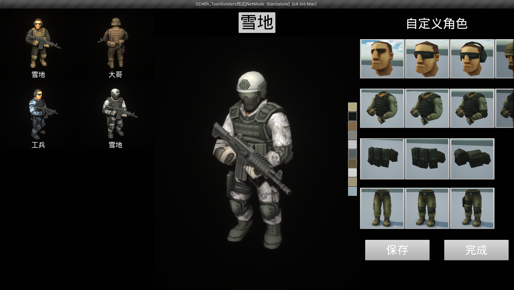
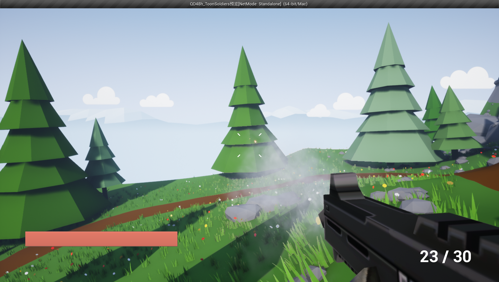

# ToonSoldiers
ToonSoldiers是一个第一人称射击游戏Demo，使用纯蓝图制作，用于学习本地联机和FPS游戏功能模块。

按键 | 操作
---|---
W、A、S、D  |   角色移动
空格  |   跳跃
鼠标左键    |   射击
R    |   装弹
P   |  暂停菜单





## 功能列表
- [x] 单人游戏
- [x] 多人联机
  - [x] 能看见敌人、能造成伤害、动作和特效正确
- [x] 武器系统 
  - [x] 轻机枪、霰弹枪
  - [ ] 切换武器（涉及武器状态之间的交互，有点复杂）
- [x] 自定义角色，保存自定义角色
  - [ ] 优化自定义角色界面，让每个保存的角色都能动起来
- [ ] 瞄准
- [ ] 冲刺、蹲
- [ ] 记录比分、胜利条件
- [ ] 队伍系统
  - [ ] 友军伤害

## 目录结构
```
.
├── Config
├── Content
│   ├── Collections
│   ├── Crosshairs_Pack
│   ├── Developers
│   ├── MilitaryWeapDark
│   ├── ShooterGame
│   ├── StylizedLowPolyEnvironment
│   ├── Toon_Soldiers_Armies
│   └── ToonSoldiers                # 项目文件夹
├── QD48h_ToonSoldiers.uproject
├── Readme.md
└── images
```